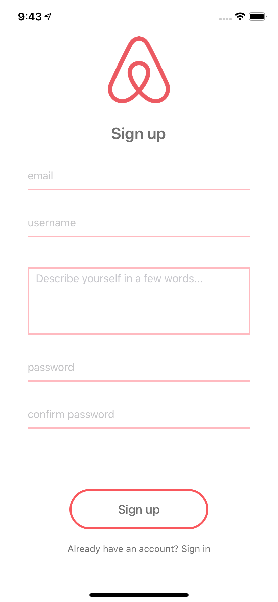
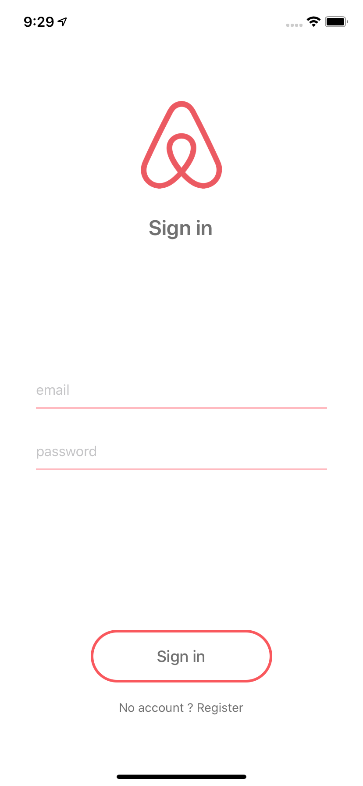
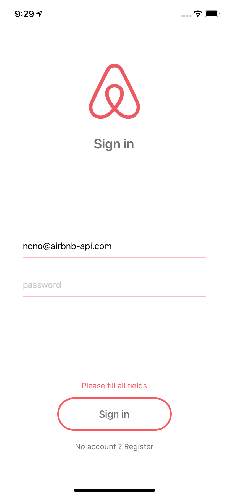

# Airbnb

## Sign up page

### SignUpScreen

Cet écran permettra à un utilisateur de s'inscrire après avoir renseigné 5 champs (email, username, description, password, confirmPassword).

- **URL:** airbnb_lereacteur/user/sign_up
- **Method:** **'POST'**
- **Body parameters:**
  - email
  - username
  - description
  - password

 

    
    

 

Le bouton **"Already have an account ? Sign in"** redirigera l'utilisateur vers l'écran **'Signin'**.

#### 📌 Notes

- Afin que le clavier (**'Cmd - K'** pour afficher le clavier) ne superpose pas les champs de saisies, utilisez le composant **'KeyboardAwareScrollView'**.

- Remarquez que les mots de passe sont **cachés**. Recherchez dans la **documentation** du composant **'TextInput'** comment le réaliser.

- **Avant de faire la requête** à l'API, il faudra vérifier que :

  - les deux mots de passe renseignés soient bien **identiques**

  - tous les champs aient été **remplis** (En cas d'erreur ou d'oubli de la part de l'utilisateur, prévoyez de le lui **indiquer**)

- L'inscription peut **échouer** si le username ou l'email sont **déjà pris en BDD**. Dans ce cas, prévoyez de l'**indiquer** à l'utilisateur afin qu'il puisse modifier ses informations.

- Une fois l'utilisateur **inscrit**, vous pourrez afficher une simple **alerte** indiquant que l'inscription a **réussi**. Pour cela, utilisez la fonction **'alert()'**. Nous verrons plus tard comment enregistrer le **token de l'utilisateur** (reçu de l'API) dans la mémoire de l'appareil (ou AsyncStorage) et ainsi passer à l'écran suivant.

#### 🚀 Bonus

- Ajouter une icône "oeil" 👁 pour tous les **'TextInput'** dédiés aux mots de passe afin de rendre **visible / invisible** le contenu.

- Afficher un **'ActivityIndicator'** le temps de la requête.

- Désactiver le bouton "Sign up" le temps de la requête.

## Log in page

### LoginScreen

Cet écran permettra, à un utilisateur enregistré en BDD, de **se connecter** à l'application après avoir renseigné deux champs (email et password).

- **URL**: airbnb_lereacteur/user/log_in
- **Method**: **'POST'**
- **Body parameters**:
  - **'email'** (nono@airbnb-api.com)
  - **'password'** (pass)

 

    
    

 

Le bouton **"No account ? Register"** redirigera l'utilisateur vers l'écran **'Signup'**.

#### 📌 Notes

- Afin que le clavier (**'Cmd - K'** pour afficher le clavier) ne se **superpose pas** aux champs de saisies, utilisez le composant **'KeyboardAwareScrollView'**.

- Remarquez que **le mot de passe est caché**. Recherchez dans la documentation du composant **'TextInput'** comment le réaliser.

- Avant de faire la **requête à l'API**, il faudra vérifier que :

  - tous les champs aient été **remplis**. En cas d'oubli de la part de l'utilisateur, prévoyez de le lui **indiquer**.

- La connexion peut **échouer** si l'email **n'existe pas** en BDD, ou si l'email et le mot de passe ne **coïncident pas**. En cas d'échec de connexion, prévoyez de l'**indiquer** à l'utilisateur.

- Une fois l'utilisateur **connecté**, vous pouvez afficher une simple **alerte** indiquant que la connexion a réussi. Pour cela, utilisez la fonction **'alert()'**. Nous verrons plus tard comment enregistrer le **token** de l'utilisateur (reçu de l'API) dans la **mémoire** de l'appareil (ou AsyncStorage) et ainsi passer à l'écran suivant.

#### 🚀 Bonus

- Ajouter une icône "oeil" 👁 pour tous les **'TextInput'** dédiés aux mots de passe afin de rendre **visible / invisible** le contenu.

- Afficher un **'ActivityIndicator'** le temps de la requête.

- Désactiver le bouton **'Sign in'** le temps de la requête.
